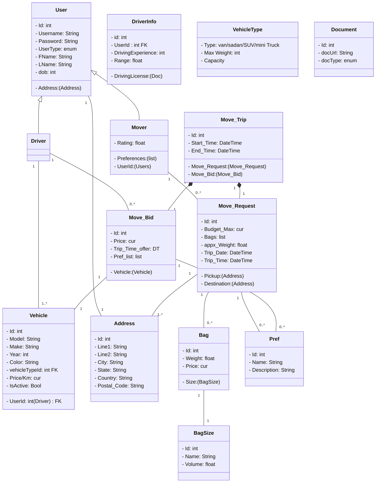

```mermaid
classDiagram

%% Classes

%% People
    class User {
        - Id: int
        - Username: String
        - Password: String
        - UserType: enum
        - FName: String
        - LName: String
        - dob: int
        - Address: (Address)
    }
    class Mover {
        - Rating: float
        - Preferences: (list<Pref>)
        - UserId: (Users)
    }
    class DriverInfo {
        - id: int
        - UserId : int FK
        - DrivingExperience: int
        - Range: float
        - DrivingLicense: (Doc)
    }

%% Things
    class Vehicle {
        - Id: int
        - UserId: int (Driver) FK
        - Model: String
        - Make: String
        - Year: int
        - Color: String
        - vehicleTypeId: int FK
        - Price/Km: cur
        - IsActive: Bool
    }
    class VehicleType{
        - Type: van/sadan/SUV/mini Truck
        - Max Weight: int
        - Capacity
    }
    class Address {
        - Id: int
        - Line1: String
        - Line2: String
        - City: String
        - State: String
        - Country: String
        - Postal_Code: String
    }
    class Bag {
        - Id: int
        - Weight: float
        - Size: (BagSize)
        - Price: cur
    }
    class BagSize {
        - Id: int
        - Name: String
        - Volume: float
    }
    class Pref {
        - Id: int
        - Name: String
        - Description: String
    }
    class Document {
        - Id: int
        - docUrl: String
        - docType: enum
    }

%% Marketplace Things
    class Move_Request {
        - Id: int
        - Pickup: (Address)
        - Destination: (Address)
        - Budget_Max: cur
        - Bags: list<Bag>
        - appx_Weight: float
        - Trip_Date: DateTime
        - Trip_Time: DateTime

    }

    class Move_Bid {
        - Id: int
        - Price: cur
        - Trip_Time_offer: DT
        - Vehicle: (Vehicle)
        - Pref_list: list<Pref>
    }

    class Move_Trip {
        - Id: int
        - Move_Request: (Move_Request)
        - Move_Bid: (Move_Bid)
        - Start_Time: DateTime
        - End_Time: DateTime
    }

%% Relationships

%% User Entities
    User <|-- Mover
    User <|-- Driver


%% Things Entities


    %% Addresses

    %% Users have Address
    User "1" -- "1" Address
    %% Move_Request have 2 Addresses
    Move_Request "1" -- "1..*" Address

    %% Drivers can have Many Vehicles
    Driver "1" -- "1..*" Vehicle

    %% Move_Request can have Many Bags
    Move_Request "1" -- "0..*" Bag

    %% Move_Bid has a Vehicle
    Move_Bid "1" -- "1" Vehicle

    %% Bags have BagSize
    Bag "1" -- "1" BagSize

    %% MoveRequests have preferences
    Move_Request "1" -- "0..*" Pref

    %% MoveBid have preferences
    Move_Bid "1" -- "0..*" Pref

    %% Marketplace Entities

    %% Movers can Create Many Move_Request
    %% Drivers can Create Many Move_Bid

    Mover "1" -- "0..*" Move_Request
    Driver "1" -- "0..*" Move_Bid

    Move_Trip "1" *-- "1" Move_Request
    Move_Trip "1" *-- "1" Move_Bid


```
