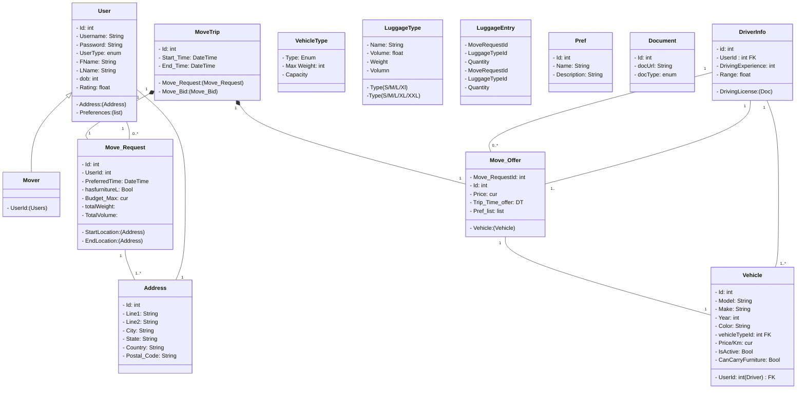

```mermaid
classDiagram

%% Classes

%% People
    class User {
        - Id: int
        - Username: String
        - Password: String
        - UserType: enum
        - FName: String
        - LName: String
        - dob: int
        - Address: (Address)
        - Rating: float
        - Preferences: (list<Pref>)
    }
    class Mover {
        - UserId: (Users)
    }
    class DriverInfo {
        - id: int
        - UserId : int FK
        - DrivingExperience: int
        - Range: float
        - DrivingLicense: (Doc)
    }

%% Things
    class Vehicle {
        - Id: int
        - UserId: int (Driver) FK
        - Model: String
        - Make: String
        - Year: int
        - Color: String
        - vehicleTypeId: int FK
        - Price/Km: cur
        - IsActive: Bool
        - CanCarryFurniture: Bool
    }
    class VehicleType{
        - Type: Enum
        - Max Weight: int
        - Capacity
    }
    class Address {
        - Id: int
        - Line1: String
        - Line2: String
        - City: String
        - State: String
        - Country: String
        - Postal_Code: String
    }
    class LuggageType {
        - Type (S/M/L/Xl)
        - Name: String
        - Volume: float
    }
    class LuggageEntry{
        - MoveRequestId
        - LuggageTypeId
        - Quantity
    }
    class Pref {
        - Id: int
        - Name: String
        - Description: String
    }
    class Document {
        - Id: int
        - docUrl: String
        - docType: enum
    }

%% Marketplace Things
    class Move_Request {
        - Id: int
        - UserId: int
        - StartLocation: (Address)
        - EndLocation: (Address)
        - PreferredTime: DateTime
        - hasfurnitureL: Bool
        - Budget_Max: cur
        - totalWeight:
        - TotalVolume:
    }

    class Move_Offer {
        - Move_RequestId: int
        - Id: int
        - Price: cur
        - Trip_Time_offer: DT
        - Vehicle: (Vehicle)
        - Pref_list: list<Pref>
    }

    class MoveTrip {
        - Id: int
        - Move_Request: (Move_Request)
        - Move_Bid: (Move_Bid)
        - Start_Time: DateTime
        - End_Time: DateTime
    }

    class LuggageType{
        -Type (S/M/L/XL/XXL)
        - Weight
        - Volumn
    }

    %% Joint Table NO relations
    class LuggageEntry{
        - MoveRequestId
        - LuggageTypeId
        - Quantity
    }

%% Relationships

%% User Entities
    User <|-- Mover


%% Things Entities

    %% -------------------Addresses-------------------


    %% VehicleType Can have many Vehicles


    %% DriverInfo can have many  MoveOffer
    DriverInfo "1" -- "1.." Move_Offer

    %% Users have Address
    User "1" -- "1" Address

    %% Move_Request have 2 Addresses
    Move_Request "1" -- "1..*" Address

    %% Drivers can have Many Vehicles
    DriverInfo "1" -- "1..*" Vehicle


    %% Move_Offer has a Vehicle
    Move_Offer "1" -- "1" Vehicle


    %% -------------------Marketplace Entities-------------------

    %% User can Create Many Move_Request
    %% Drivers can Create Many Move_Offer

    User "1" -- "0..*" Move_Request
    DriverInfo "1" -- "0..*" Move_Offer

    MoveTrip "1" *-- "1" Move_Request
    MoveTrip "1" *-- "1" Move_Offer


```
