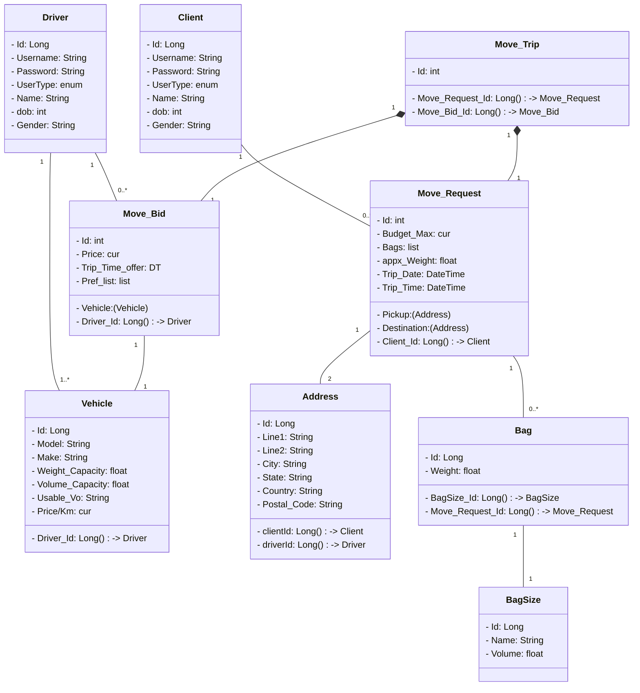

```mermaid
classDiagram
    class Client {
        - Id: Long
        - Username: String
        - Password: String
        - UserType: enum
        - Name: String
        - dob: int
        - Gender: String
    }
    class Driver {
        - Id: Long
        - Username: String
        - Password: String
        - UserType: enum
        - Name: String
        - dob: int
        - Gender: String
    }
    class Vehicle {
        - Id: Long
        - Model: String
        - Make: String
        - Weight_Capacity: float
        - Volume_Capacity: float
        - Usable_Vo: String
        - Price/Km: cur
        - Driver_Id: Long ()-> Driver
    }
    class Address {
        - Id: Long
        - Line1: String
        - Line2: String
        - City: String
        - State: String
        - Country: String
        - Postal_Code: String
        - clientId: Long ()-> Client
        - driverId: Long ()-> Driver
    }
    class Move_Request {
        - Id: int
        - Pickup: (Address)
        - Destination: (Address)
        - Budget_Max: cur
        - Bags: list<Bag>
        - appx_Weight: float
        - Trip_Date: DateTime
        - Trip_Time: DateTime
        - Client_Id: Long ()-> Client
    }
    class Move_Bid {
        - Id: int
        - Price: cur
        - Trip_Time_offer: DT
        - Vehicle: (Vehicle)
        - Pref_list: list<Pref>
        - Driver_Id: Long ()-> Driver
    }
    class Move_Trip {
        - Id: int
        - Move_Request_Id: Long ()-> Move_Request
        - Move_Bid_Id: Long ()-> Move_Bid
    }
    class Bag {
        - Id: Long
        - Weight: float
        - BagSize_Id: Long ()-> BagSize
        - Move_Request_Id: Long ()-> Move_Request
    }
    class BagSize {
        - Id: Long
        - Name: String
        - Volume: float
    }

    %% Relations

    %% Move_Request have 2 Addresses
    Move_Request "1" -- "2" Address

    %% Drivers can have Many Vehicles
    Driver "1" -- "1..*" Vehicle

    %% Move_Request can have Many Bags
    Move_Request "1" -- "0..*" Bag

    %% Move_Bid has a Vehicle
    Move_Bid "1" -- "1" Vehicle

    %% Bags have BagSize
    Bag "1" -- "1" BagSize

    %% Marketplace Entities

    %% Movers can Create Many Move_Request
    %% Drivers can Create Many Move_Bid

    Client "1" -- "0..*" Move_Request
    Driver "1" -- "0..*" Move_Bid

    Move_Trip "1" *-- "1" Move_Request
    Move_Trip "1" *-- "1" Move_Bid


```

# Questions:

- Should Clients and Drivers be saparate tables?
- Should Address table have clientId and driverId? or just a userId?
- Should BagSize be a table or just a field in Bag table?
