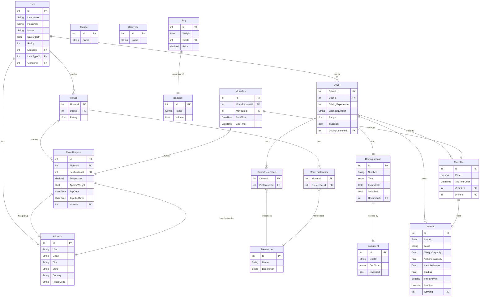

```mermaid
erDiagram
    User {
        int Id PK
        String Username
        String Password
        String Name
        Date DateOfBirth
        int Rating
        int Location FK
        int UserTypeId FK
        int GenderId FK
    }
    %% // NOTE: Gender is Enum
    Gender{
        int Id PK
        String Name
    }

    %% //NOTE: UserType is Enum
    UserType{
        int Id PK
        String Name
    }
    Address {
        int Id PK
        String Line1
        String Line2
        String City
        String State
        String Country
        String PostalCode
    }
    %% // NOTE: Mover Table is not needed, Mover is a User
    Mover {
        int MoverId PK
        int UserId FK
        float Rating
    }

    Driver {
        int DriverId PK
        int UserId FK
        int DrivingExperience
        String LicenseNumber
        float Range
        %% // NOTE: the implementation is not confirmed yet
        bool isVarified
        int DrivingLicenseId FK
    }

%% // NOTE: Document and Driving Licience implementation is not confirmed yet
    Document {
        int Id PK
        String DocUrl
        enum DocType
        bool isVarified
    }

    DrivingLicense {
        int Id PK
        String Number
        enum Type
        Date ExpiryDate
        bool isVarified
        int DocumentId FK
    }

    Vehicle {
        int Id PK
        String Model
        String Make
        float WeightCapacity
        float VolumeCapacity
        float UsableVolume
        float Radius
        decimal PricePerKm
        boolean IsActive
        int DriverId FK
    }
    
    %% // TODO: Fields are not confirmed yet
    Bag {
        int Id PK
        float Weight
        int SizeId FK
        decimal Price
    }
    
    %% // TODO: Explore the possibility of using Enum
    BagSize {
        int Id PK
        String Name
        float Volume
    }

    %% // NOTE: All Preference related functionalies are not implemented yet
    Preference {
        int Id PK
        String Name
        String Description
    }

        MoverPreference {
        int MoverId FK
        int PreferenceId FK
    }
    DriverPreference {
        int DriverId FK
        int PreferenceId FK
    }

    
    MoveRequest {
        int Id PK
        int PickupId FK
        int DestinationId FK
        %% // TODO: Make it integer in cents
        decimal BudgetMax      
        float ApproxWeight
        DateTime TripDate
        DateTime TripStartTime
        int MoverId FK
    }

    MoveBid {
        int Id PK
        %%  // TODO: Make it integer in cents\
        decimal Price          
        DateTime TripTimeOffer
        int VehicleId FK
        int DriverId FK
    }


    MoveTrip {
        int Id PK
        int MoveRequestId FK
        int MoveBidId FK
        DateTime StartTime
        DateTime EndTime
    }


    User ||--o| Address : "has"
    User ||--o{ Mover : "can be"
    User ||--o{ Driver : "can be"
    Driver ||--|| DrivingLicense : "has"
    DrivingLicense ||--o| Document : "verified by"
    Driver ||--|{ Vehicle : "owns"
    Driver ||--|{ DriverPreference : "has"
    DriverPreference }|--|| Preference : "references"
    Mover ||--|{ MoverPreference : "has"
    MoverPreference }|--|| Preference : "references"
    MoveRequest ||--|| Address : "has pickup" 
    MoveRequest ||--|| Address : "has destination"
    Bag ||--|| BagSize : "uses size of"
    MoveBid ||--|| Vehicle : "uses"
    Mover ||--|{ MoveRequest : "creates"
    Driver ||--|{ MoveBid : "submits"
    MoveTrip ||--|| MoveRequest : "fulfills"
    MoveTrip ||--|| MoveBid : "accepts"
```