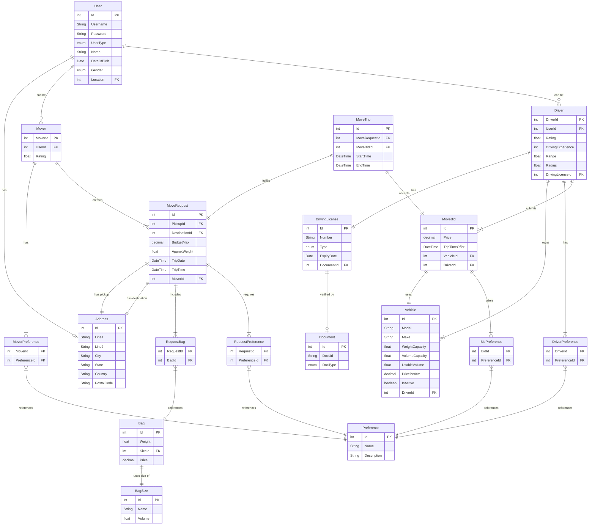

```mermaid
erDiagram
    User {
        int Id PK
        String Username
        String Password
        enum UserType
        String Name
        Date DateOfBirth
        enum Gender
        int Location FK
    }
    Address {
        int Id PK
        String Line1
        String Line2
        String City
        String State
        String Country
        String PostalCode
    }
    Mover {
        int MoverId PK
        int UserId FK
        float Rating
    }
    Driver {
        int DriverId PK
        int UserId FK
        float Rating
        int DrivingExperience
        float Range
        float Radius
        int DrivingLicenseId FK
    }
    DrivingLicense {
        int Id PK
        String Number
        enum Type
        Date ExpiryDate
        int DocumentId FK
    }
    Vehicle {
        int Id PK
        String Model
        String Make
        float WeightCapacity
        float VolumeCapacity
        float UsableVolume
        decimal PricePerKm
        boolean IsActive
        int DriverId FK
    }
    Bag {
        int Id PK
        float Weight
        int SizeId FK
        decimal Price
    }
    BagSize {
        int Id PK
        String Name
        float Volume
    }
    Preference {
        int Id PK
        String Name
        String Description
    }
    Document {
        int Id PK
        String DocUrl
        enum DocType
    }
    MoveRequest {
        int Id PK
        int PickupId FK
        int DestinationId FK
        decimal BudgetMax
        float ApproxWeight
        DateTime TripDate
        DateTime TripTime
        int MoverId FK
    }
    RequestBag {
        int RequestId FK
        int BagId FK
    }
    MoverPreference {
        int MoverId FK
        int PreferenceId FK
    }
    DriverPreference {
        int DriverId FK
        int PreferenceId FK
    }
    RequestPreference {
        int RequestId FK
        int PreferenceId FK
    }
    MoveBid {
        int Id PK
        decimal Price
        DateTime TripTimeOffer
        int VehicleId FK
        int DriverId FK
    }
    BidPreference {
        int BidId FK
        int PreferenceId FK
    }
    MoveTrip {
        int Id PK
        int MoveRequestId FK
        int MoveBidId FK
        DateTime StartTime
        DateTime EndTime
    }

    User ||--o| Address : "has"
    User ||--o{ Mover : "can be"
    User ||--o{ Driver : "can be"
    Driver ||--|| DrivingLicense : "has"
    DrivingLicense ||--o| Document : "verified by"
    Driver ||--|{ Vehicle : "owns"
    Driver ||--|{ DriverPreference : "has"
    DriverPreference }|--|| Preference : "references"
    Mover ||--|{ MoverPreference : "has"
    MoverPreference }|--|| Preference : "references"
    MoveRequest ||--|| Address : "has pickup" 
    MoveRequest ||--|| Address : "has destination"
    MoveRequest ||--|{ RequestBag : "includes"
    RequestBag }|--|| Bag : "references"
    Bag ||--|| BagSize : "uses size of"
    MoveBid ||--|| Vehicle : "uses"
    MoveBid ||--|{ BidPreference : "offers"
    BidPreference }|--|| Preference : "references"
    MoveRequest ||--|{ RequestPreference : "requires"
    RequestPreference }|--|| Preference : "references"
    Mover ||--|{ MoveRequest : "creates"
    Driver ||--|{ MoveBid : "submits"
    MoveTrip ||--|| MoveRequest : "fulfills"
    MoveTrip ||--|| MoveBid : "accepts"
```