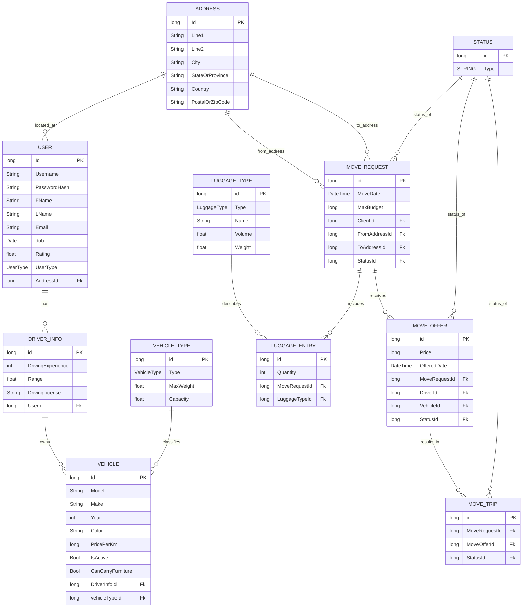

```mermaid
erDiagram
    USER {
        long Id PK
        String Username
        String PasswordHash
        String FName
        String LName
        String Email
        Date dob
        float Rating
        UserType UserType
        long AddressId Fk
    }

    DRIVER_INFO {
        long id PK
        int DrivingExperience
        float Range
        String DrivingLicense
        long UserId Fk
    }

    VEHICLE {
        long Id PK
        String Model
        String Make
        int Year
        String Color
        long PricePerKm
        Bool IsActive
        Bool CanCarryFurniture
        %% UserId
        long DriverInfoId Fk
        long vehicleTypeId Fk
    }

    VEHICLE_TYPE {
        long id PK
        VehicleType Type
        float MaxWeight
        float Capacity
    }

    ADDRESS {
        long Id PK
        String Line1
        String Line2
        String City
        String StateOrProvince
        String Country
        String PostalOrZipCode
    }

    LUGGAGE_TYPE {
        long id PK
        LuggageType Type
        String Name
        float Volume
        float Weight
    }

    LUGGAGE_ENTRY {
        long id PK
        int Quantity
        long MoveRequestId Fk
        long LuggageTypeId Fk
    }

    MOVE_REQUEST {
        long id PK
        DateTime MoveDate
        long MaxBudget
        long ClientId Fk
        long FromAddressId Fk
        long ToAddressId Fk
        long StatusId Fk
    }

    MOVE_OFFER {
        long id PK
        long Price
        DateTime OfferedDate
        long MoveRequestId Fk
        long DriverId Fk
        long VehicleId Fk
        long StatusId Fk
    }

    MOVE_TRIP{
        long id PK
        long MoveRequestId Fk
        long MoveOfferId Fk
        long StatusId Fk
    }

    STATUS {
        long id PK
        STRING Type
    }

    %% Relationships
    USER ||--o{ DRIVER_INFO: has
    DRIVER_INFO ||--o{ VEHICLE: owns
    VEHICLE_TYPE ||--o{ VEHICLE: classifies
    ADDRESS ||--o{ USER: located_at
    ADDRESS ||--o{ MOVE_REQUEST: from_address
    ADDRESS ||--o{ MOVE_REQUEST: to_address
    LUGGAGE_TYPE ||--o{ LUGGAGE_ENTRY: describes
    MOVE_REQUEST ||--o{ LUGGAGE_ENTRY: includes
    MOVE_REQUEST ||--o{ MOVE_OFFER: receives
    MOVE_OFFER ||--o{ MOVE_TRIP: results_in
    STATUS ||--o{ MOVE_REQUEST: status_of
    STATUS ||--o{ MOVE_OFFER: status_of
    STATUS ||--o{ MOVE_TRIP: status_of
```
