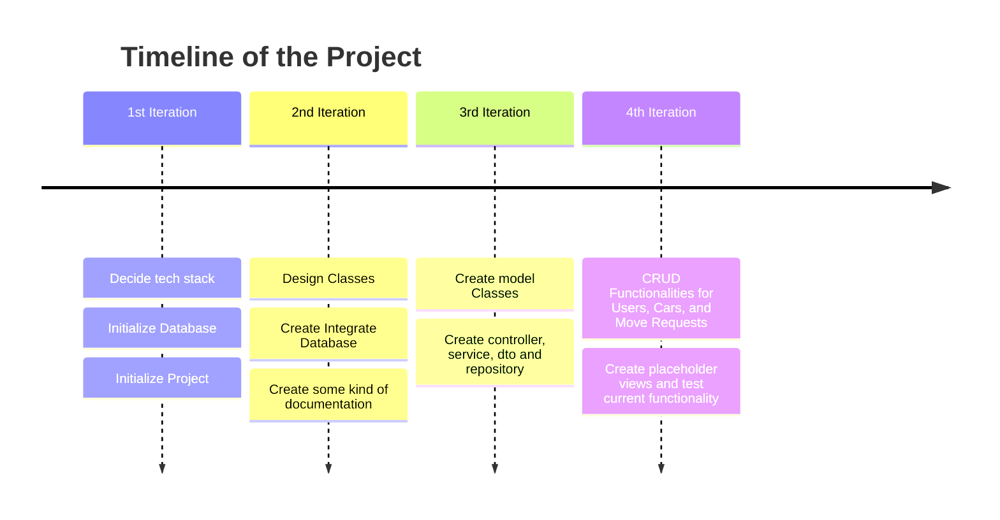

```mermaid

timeline
    title Timeline of the Project
        1st Iteration: Decide tech stack
                     : Initialize Database
                     : Initialize Project
        2nd Iteration: Design Classes
                     : Create Integrate Database
                     : Create some kind of documentation
        3rd Iteration: Create model Classes
                     : Create controller, service, dto and repository
        4th Iteration: CRUD Functionalities for Users, Cars, and Move Requests
                     : Create placeholder views and test current functionality


```