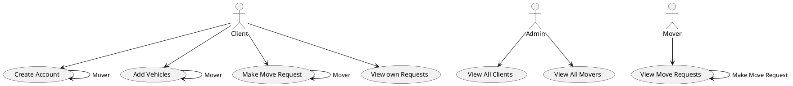

```plantuml
@startuml
actor Client
actor Admin
actor Mover

Client --> (Create Account)
Client --> (Add Vehicles)
Client --> (Make Move Request)
Client --> (View own Requests)

(Create Account) --> (Create Account) : Mover
(Add Vehicles) --> (Add Vehicles) : Mover
(Make Move Request) --> (Make Move Request) : Mover

Admin --> (View All Clients)
Admin --> (View All Movers)
Mover --> (View Move Requests)
(View Move Requests) --> (View Move Requests) : Make Move Request
@enduml

```