# User Guide

### Login Page

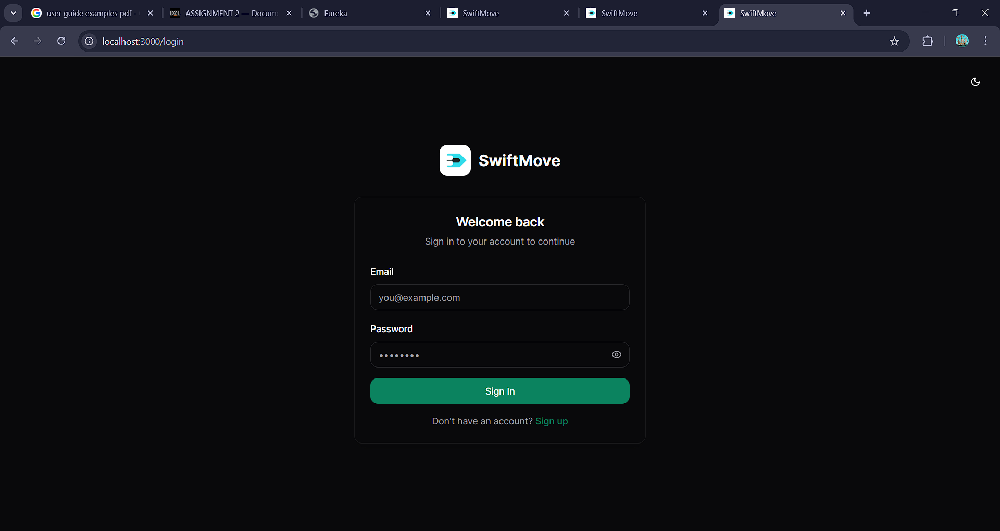

Whenever the client logs in, they land on the client dashboard, which looks like this (refer to image 2.0).

### Creating a Move Request

**Step 1: Select Move Requests**

Select the **"Move Requests,"** or if it's the first time using the Swift Move platform, you can directly choose the **"Create Request"** from the welcome page itself.

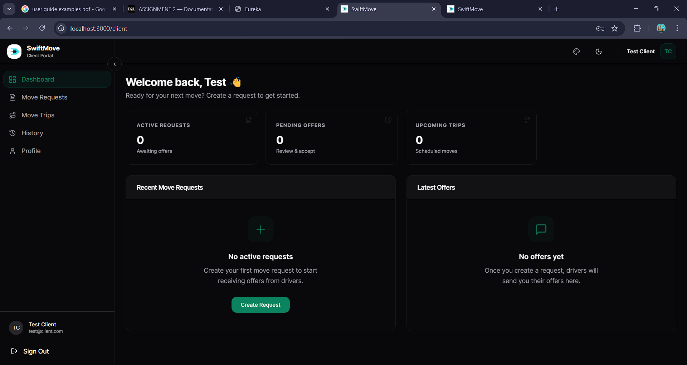

**Step 1.2: Create Move Request Form**

After going to the Move Requests page, click on the **"+ New Request"**, which prompts you to **"Create Move Request"** form (refer to image 3.1).

If the clients cannot decide on a price, they can ask the system to suggest one. This will suggest a fair price (refer to image 3.3).

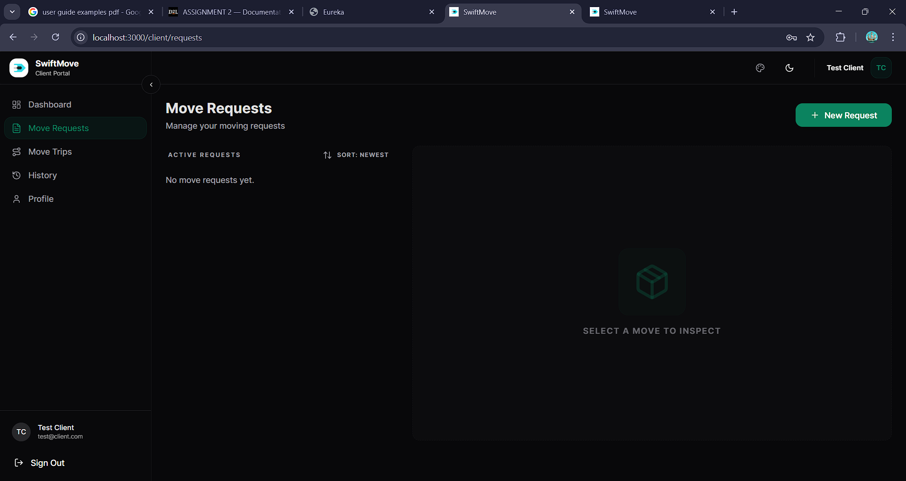

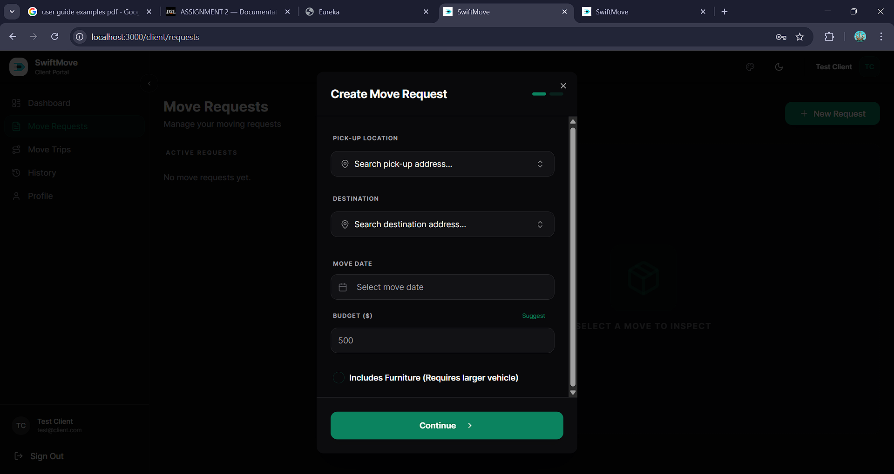

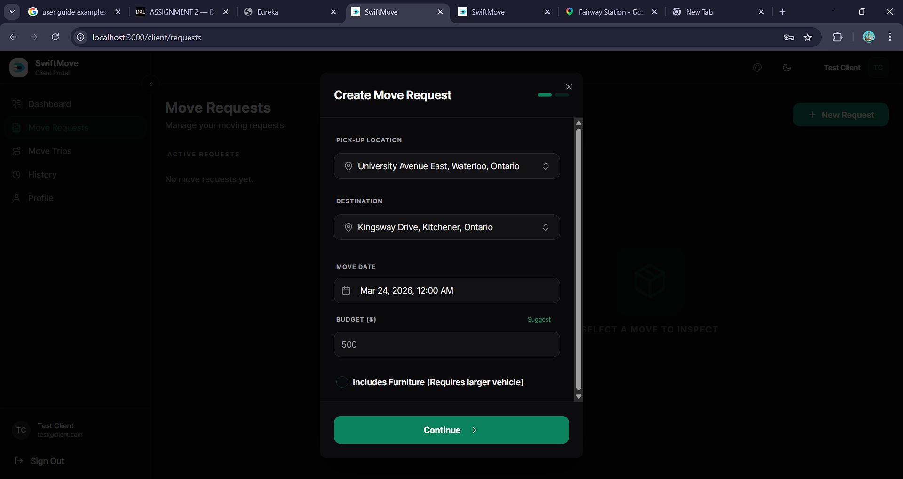

**Step 2.3: Add Luggage Entries**

After clicking the **"Continue"** button in the form, it's time to add the luggage entries that are required for the particular Move Request. For more information on luggage dimensions, please refer to our **"Size Guide"** (see image 4.2).

After entering the required data, click **"Submit Request"**.

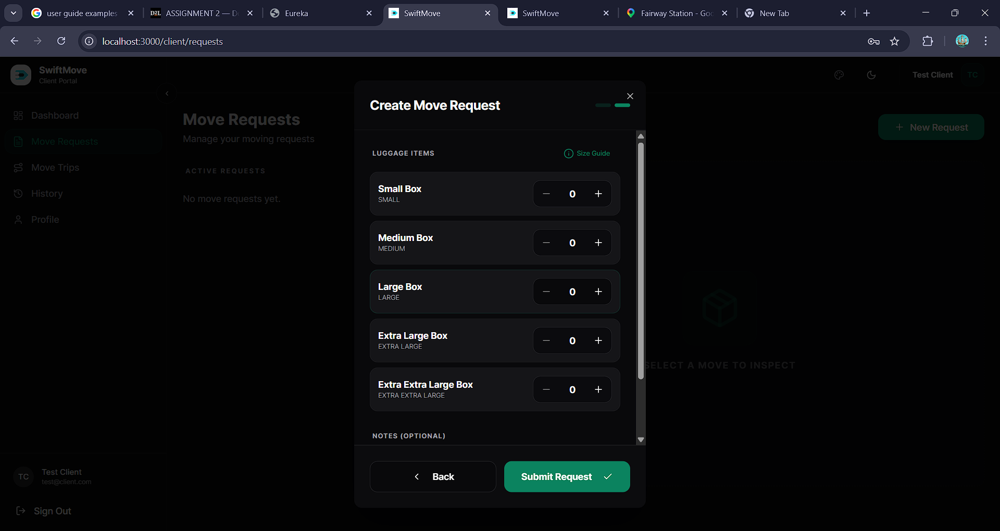

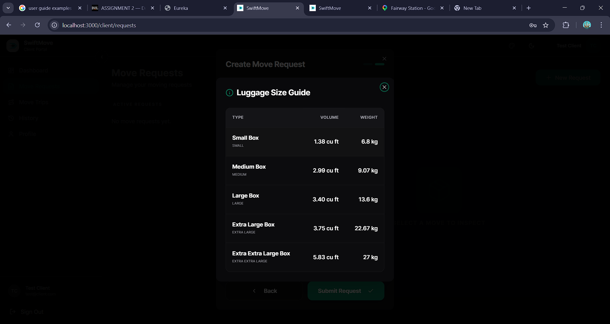

**Step 3.4: Track Your Request**

Congratulations! You just created your first Move Request. Now, let's wait patiently for the driver to make you an offer for your Move Request. In the meantime, you can check and verify your route and addresses in Google Maps by selecting the **"Maps"** and/or **"View Routes"** options (refer to image 5.2).

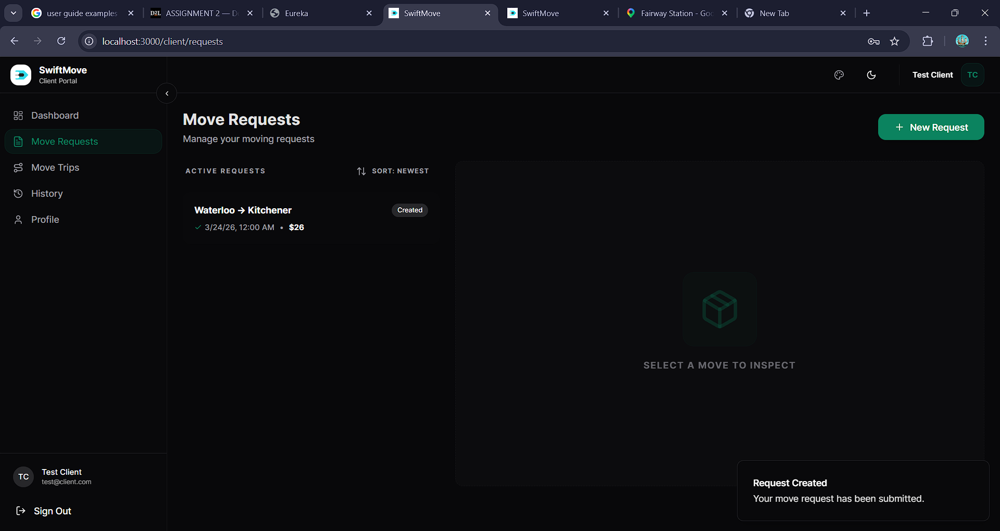

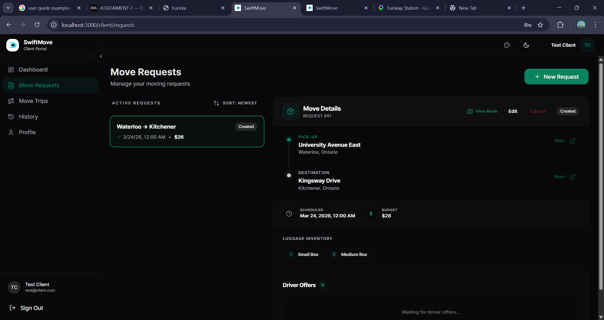

**Step 5: Driver Offers**

Great! Looks like a driver has offered you a move for your request. For now, there is only one move offer from one driver for testing. However, when you are using the platform, you can get multiple move offers for the same request, and you can review and accept or reject as you like.

**Step 6: Confirmation**

Congratulations! After accepting, you have just created your first move trip, and you can see the details on the move trip page. We hope you have a safe and great moving experience!

### Profile Page

The profile page allows you to edit your profile credentials.

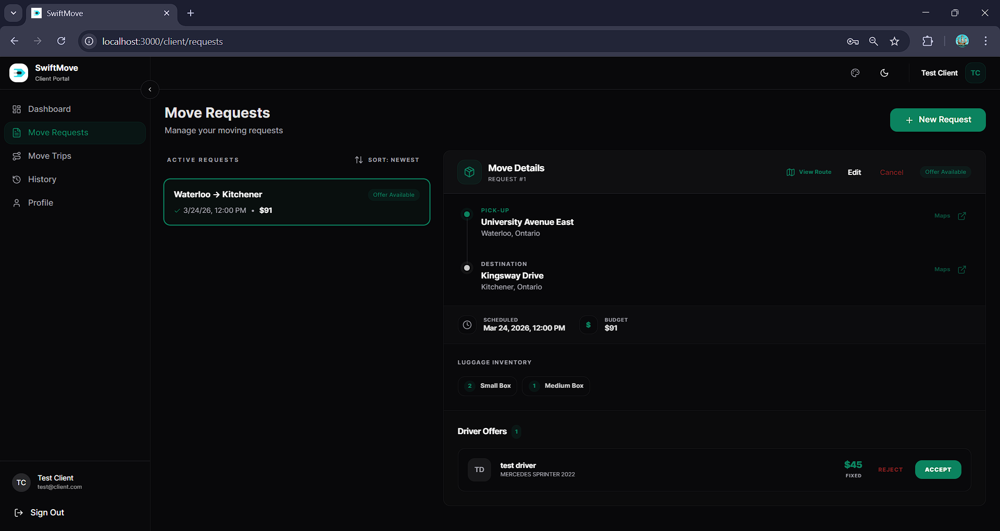

---

## If You're a Driver

### Landing Page

Follow the following steps to review and make a move offer.

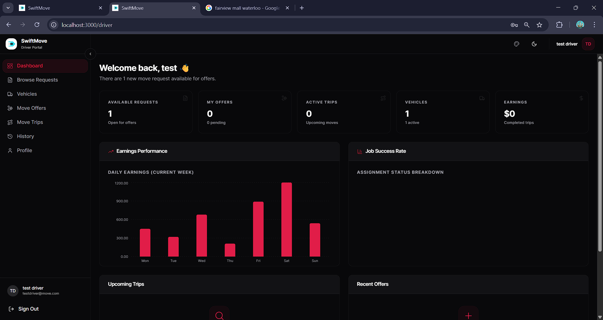

**Step 1: Browse Requests**

Go to the **Browse Request** to review the available move requests.

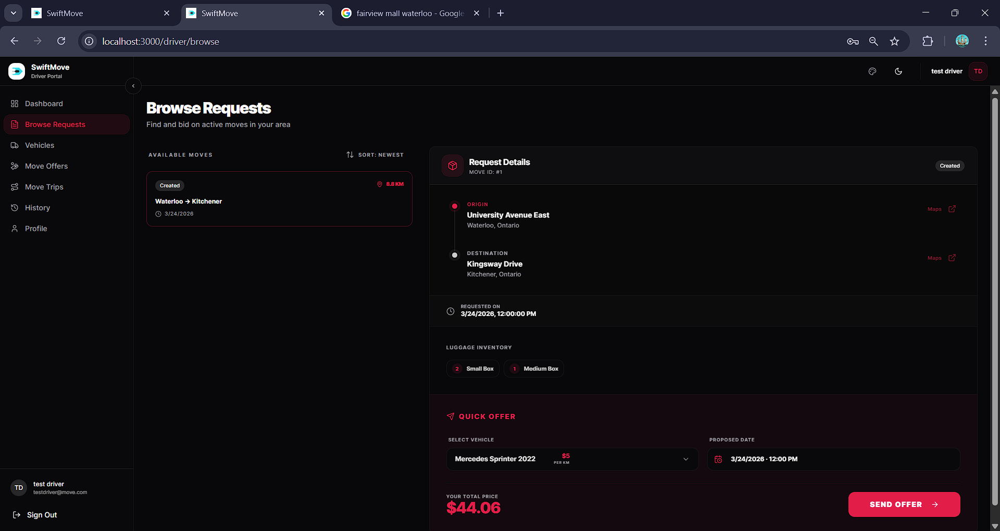

**Step 2: Send an Offer**

After you sent an offer to the move request, it will be available in the **"Move Offer Page."**

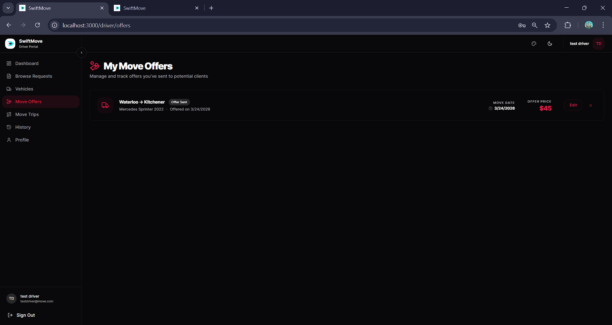

**Step 3: Congratulations**

Congratulations on earning your first move trip.
